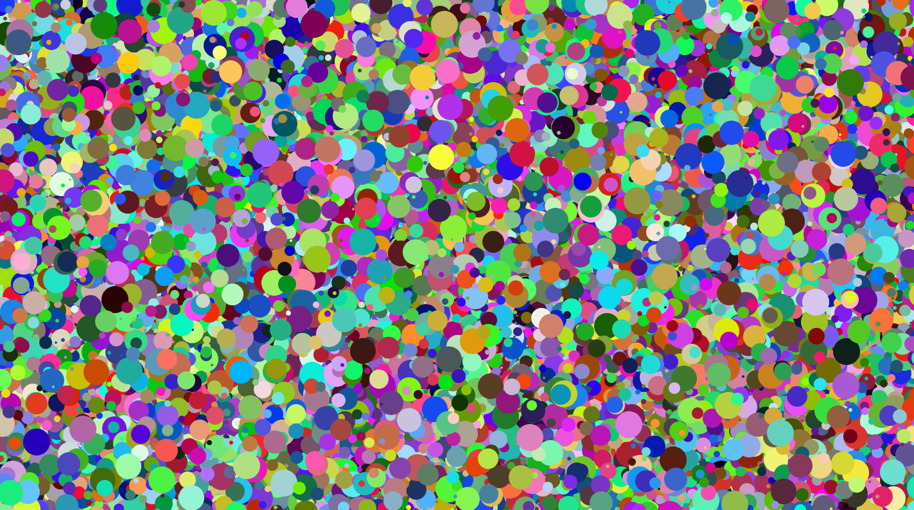

# art with html5 canvas

## How To Run
1. Run the command `npx http-server .`
2. Visit `localhost:8080`

## Results

#### Warning
Running this might freeze your browser although with some beautiful art on your screen!
